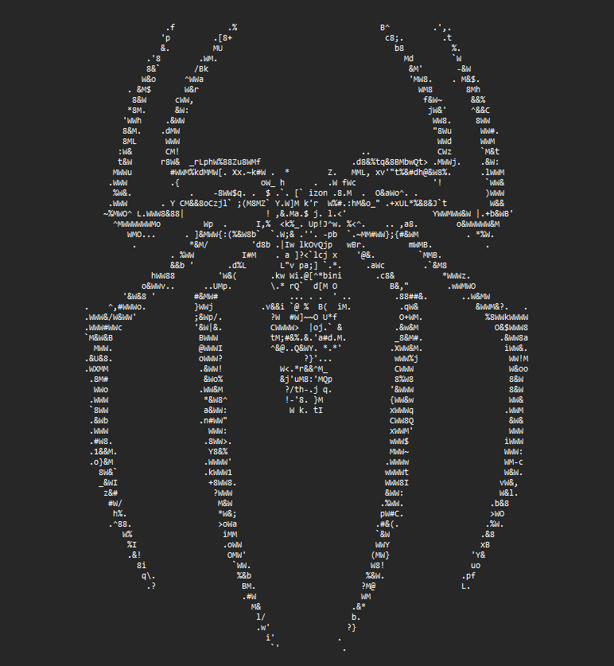

# ASCII Art Generator
A Python script that converts images into ASCII art using NumPy.
This program transforms regular images (.jpg, .png) into text-based art using ASCII characters like `@`, `#`, `*`, `.`. The output can be viewed in a terminal or saved to a text file.

## How to Use
1. Place your image in the `project/op&ip` folder
2. Run: `python ascii_art_generator.py`
3. Find the output in `project/op&ip/output_art.txt`

## Example Images
<div style="display: flex; justify-content: space-between;">
    <div style="flex: 1;">
        <h3>Input Image</h3>
        
    </div>
    <div style="flex: 1;">
        <h3>Output ASCII Art</h3>
        
    </div>
</div>


## Project Structure
```
numpy/
│
├── project/
│   ├── ascii_art_generator.py
│   └── op&ip/
│       ├── sample_1.jpeg
│       └── output_art_1.txt
│
└── README.md
```

## Implementation Details
1. Image Loading: Uses PIL to load image into NumPy array
2. Grayscale Conversion: Applies RGB weights (0.2989R + 0.5870G + 0.1140B)
3. Downsampling: Reduces image size for terminal display
4. ASCII Mapping: Maps pixel values to ASCII characters
5. Output Generation: Saves result to text file

## Key Features
- Configurable downsampling factor
- Customizable ASCII character set
- Supports common image formats
- Efficient NumPy-based processing

## Requirements
- Python 3.x
- NumPy
- Pillow (PIL)
